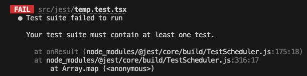
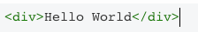

# 几个软件开发的方法论：

1. 测试驱动开发（Test-Driven Development，简称 TDD）是一种软件开发方法论，其核心思想是在编写代码之前先编写测试用例，然后根据测试用例来编写代码，以确保代码的正确性和可维护性。

2. 行为驱动开发（Behavior-Driven Development，BDD）：与 TDD 类似，也是一种测试驱动开发方法，但更加关注软件的行为和业务价值，强调开发者、测试人员和业务人员之间的合作。

3. 模型驱动开发（Model-Driven Development，MDD）：一种基于模型的软件开发方法，将软件系统看作是一系列模型的集合，通过模型之间的映射和转换来实现软件的开发、测试和维护。

> 我们目前应该是行为驱动开发：开发人员的设计逻辑是帮助用户完成某一或某些行为
> 如果转化为测试驱动开发，则需要把用户行为分解为一系列输入和输出，暂且称为元行为，编写代码对元行为（原子模块）进行验证（单元测试），某一范围内的原子级行为通过测试以后可以进行不同级别的集成测试，确保原子级的元行为到原始的用户行为都可以在确定的输入下给出预期的输出，即完成开发，这些用于测试的代码即为结构化的程序源代码。
> 先编写测试，再编写最少的代码以通过测试

# 单元测试、集成测试和端到端测试的基本概念

- 单元测试：测试最小的软件模块（如一个函数、一个类等）是否按照预期工作。它通常在开发阶段由开发人员编写和运行。

- 集成测试：测试多个软件模块在一起是否按预期相互协作。它通常在开发阶段由开发人员完成，也可能在测试人员的指导下完成。

- 端到端测试：测试整个软件系统是否按照预期工作，包括所有模块、服务和界面。它通常在开发和部署后由测试人员或自动化测试工具执行。

> 单元测试和集成测试主要用于在开发阶段及早发现和解决问题，从而提高开发效率和软件质量。
> 端到端测试主要用于确保整个系统在实际环境中按照预期工作，从而提高软件可靠性和用户满意度。

# 开发阶段所需要进行的测试主要包括以下几种：

1. 单元测试：单元测试是对代码的最小单元进行测试，可以测试函数、方法、类等。单元测试可以在开发阶段及时发现代码中的错误和缺陷，确保代码的质量和稳定性，并且可以提高代码的可维护性和可重用性。
2. 集成测试：集成测试是对整个系统进行测试，以确保各个组件之间的交互和通信正常。在集成测试中，需要模拟各种使用场景和情况，确保系统能够正常运行，并且能够满足用户的需求。
3. 系统测试：系统测试是对整个软件系统进行测试，以确保系统能够正常运行，并且能够满足用户的需求。在系统测试中，需要进行各种功能测试、性能测试、安全测试等，以确保软件系统的质量和可靠性。
4. 验收测试：验收测试是对软件的功能进行验证，以确保软件能够满足客户的需求，并且能够正常使用。在验收测试中，需要使用客户提供的测试用例进行测试，并及时发现和修复问题。
5. 冒烟测试：冒烟测试是在每次代码修改后进行的测试，以确保修改的代码没有破坏原有的功能和稳定性。在冒烟测试中，需要对代码进行快速测试，以及时发现和修复问题。

# 测试的设计逻辑：

1. 正向测试:当前置条件满足时，验证代码的结果确实符合预期
2. 反向测试:当前置条件或者输入不符合要求时，代码能优雅地进行处理
3. 异常测试:代码在应该抛出异常的地方正确地抛出了异常

# 设计测试用例的原则

设计测试时，要让这些测试保持 FAIR，即快速(fast)、自动化(automated)、独立(isolated)和可重复(repeatable)。

> 1. 快速：快速的测试意味着 快速反馈。如果测试耗时较长，就不太想用了
> 2. 自动化：测试最主要的作用就是自动化验证代码，要自动化验证而非手动验证。
> 3. 独立：独立的测试可以以任意顺序执行，而且你可以选择运行一部分测试或所有测试。在运行一个测试时不需要先运行任何其他测试。
> 4. 可重复：测试应该是可以重复的。无须进行手动或耗时的设置、清理操作就能多次运行测试。

# 测试中常见的问题

| 影响                   | 原由                             | 后果                                 |
| ---------------------- | -------------------------------- | ------------------------------------ |
| 长函数                 | 低内聚、高耦合                   | 难以理解、修改成本高、难以验证和测试 |
| 一段代码做很多事       | 缺乏单一职责                     | 代码不稳定、难以重用、难以验证和测试 |
| 代码依赖过多           | 高耦合                           | 代码脆弱、经常中断                   |
| 代码直接依赖第三方代码 | 紧耦合                           | 无法扩展                             |
| 代码重复               | 不必要的重复                     | 不得不花费更多时间和精力来修复错误   |
| 代码具有不必要的复杂性 | 违背了 YAGNI(“你不需要它”)的原则 | 难以修改、可能包含无用代码           |

# jest 官方文档的建议

如果一个测试用例作为另一个更大的测试用例中的一部分时，经常运行失败，但单独运行是成功的，要考虑其他测试对这个测试的影响。
通常可以通过修改 `beforeEach` 来清除一些共享的状态来修复这种问题。 如果你不确定哪些分享的状态被修改了，你可以尝试在 `beforeEach` 打印出来看看。

# Jest 支持以下几种测试类型：

1. 单元测试：Jest 支持对 JavaScript 代码的单元测试，可以测试函数、方法、类等。使用 Jest 进行单元测试非常简单，只需要编写适当的测试用例和断言即可。

2. 集成测试：Jest 可以与其他工具和框架一起使用，支持对整个系统进行集成测试。例如，可以使用 Jest 与 React 框架一起使用，对 React 组件进行测试。

3. 性能测试：Jest 可以与其他性能测试工具一起使用，支持对 JavaScript 应用程序的性能进行测试。例如，可以使用 Jest 与 JMeter 一起使用，对 JavaScript 应用程序的性能进行测试。

# GPT4 给初学者的 Jest 学习计划

## 第一周：了解基本概念和环境搭建

1. 学习基本的测试概念，如单元测试、集成测试、端到端测试等。
2. 了解 Jest 的基本概念，包括测试套件、测试用例、断言等。
3. 在你的 React 项目中设置 Jest，可以使用 Create React App 或手动配置。

## 第二周：编写简单的单元测试

1. 学习 Jest 的匹配器（Matchers），如 `toBe`、`toEqual`、`toBeDefined` 等。
2. 编写基本的单元测试，测试一些简单的 JavaScript 函数。
3. 学习使用 `describe` 和 `it` 组织你的测试用例。
4. 学习 Jest 的钩子函数（如 `beforeEach`、`afterEach` 等），了解如何在测试之前和之后执行特定操作。

## 第三周：测试 React 组件

1. 学习 React 测试库（如 `@testing-library/react`），了解如何使用它来测试 React 组件。
2. 学习如何测试 React 组件的渲染、事件处理以及状态更新。
3. 学习使用 Jest 的快照测试（Snapshot Testing），了解如何用它来测试组件的输出。

## 第四周：编写集成测试和模拟

1. 学习如何编写集成测试，了解如何测试多个组件之间的交互。
2. 学习使用 Jest 的模拟功能（Mocking），了解如何模拟函数、模块和定时器等。
3. 学习如何模拟网络请求，如使用 `axios-mock-adapter` 或 `nock` 等库。
4. 学习使用 Jest 的代码覆盖率报告（Code Coverage），了解如何检查你的测试覆盖率。

## 第五周：优化和持续集成

1. 学习如何优化 Jest 的运行速度，如使用 `--watch` 选项进行持续测试。
2. 学习如何将 Jest 与其他测试工具（如 Enzyme、Cypress 等）结合使用。
3. 学习如何将 Jest 与持续集成（CI）工具（如 Travis CI、GitHub Actions 等）结合使用，确保每次提交都自动运行测试。


# 第一周：了解基本概念和环境搭建

## jest 的基本概念

1. 测试套件（test suite）：一个测试套件是一组相关的测试用例，通常对应于一个模块、组件或功能。

   - 测试套件（test suite）：

   ```javascript
   describe("myModule", () => {
     // test cases go here
   });
   ```

> 在这个例子中，我们定义了一个名为 `myModule` 的测试套件，包含一组相关的测试用例。
>
> 
>
> 至少需要包含一个test，否则会报错（把下面的例子加到上面来测试就通过了）

2.  测试用例（test case）：一个测试用例是一个测试套件中的一个单独的测试，用于验证代码是否按照预期工作。每个测试用例通常包括一系列输入和期望输出。

    - 测试用例（test case）：

```javascript
test("adds 1 + 2 to equal 3", () => {
  expect(1 + 2).toBe(3);
});
```

> 在这个例子中，我们定义了一个名为 `adds 1 + 2 to equal 3` 的测试用例，用于验证表达式 `1 + 2` 是否等于 `3`。

1.  断言（assertion）：一个断言是一个条件表达式，用于验证代码是否按照预期工作。每个测试用例通常包括一个或多个断言。

    - 断言（assertion）：

```javascript
test("returns true for a valid email", () => {
  expect(isValidEmail("example@example.com")).toBe(true);
});
```

> 在这个例子中，我们使用 `expect()` 函数进行断言，检查 `isValidEmail()` 函数是否正确地验证了一个有效的电子邮件地址。

1.  匹配器（matcher）：一个匹配器是一个函数，用于检查实际值是否符合预期值。Jest 包括许多内置的匹配器，如 `expect(a).toBe(b)`，其中 `toBe` 是匹配器函数，用于检查 `a` 是否等于 `b`。

    - 匹配器（matcher）：

```javascript
test("returns the correct greeting", () => {
  expect(getGreeting("John")).toBe("Hello, John!");
});
```

> 在这个例子中，我们使用 `toBe()` 匹配器函数，检查 `getGreeting()` 函数是否正确地返回了特定名称的问候语。

1. Mock（模拟对象）：一个 Mock 对象是一个模拟的对象，用于代替实际的对象，在测试中模拟其行为。Jest 提供了许多内置的 Mock API，如 `jest.fn()` 用于创建一个模拟函数。

   - 模拟对象（Mock）：

   ```javascript
   test("calls the callback function with the correct data", () => {
     const callback = jest.fn();
     fetchData(callback);
     expect(callback).toHaveBeenCalledWith({ data: "example" });
   });
   ```

   > 在这个例子中，我们通过使用 `jest.fn()` 函数模拟了一个回调函数，并检查它是否被正确地调用，并传递了正确的数据。

# 第二周：编写简单的单元测试

## 一、匹配器（Matchers）

toBe(): 用于比较两个值是否相等，使用的是严格相等运算符（===）。

```javascript
test("两个数字是否相等", () => {
  expect(2 + 2).toBe(4);
});
```

---

toEqual(): 用于比较两个对象是否相等，递归比较对象的属性和属性值。

```javascript
test("两个对象是否相等", () => {
  const user1 = {
    name: "Alice",
    age: 30,
  };
  const user2 = {
    name: "Alice",
    age: 30,
  };
  expect(user1).toEqual(user2);
});
```

---

toMatch(): 用于检查字符串是否匹配给定的正则表达式。

```javascript
test("字符串是否匹配正则表达式", () => {
  expect("hello world").toMatch(/world/);
});
```

---

 toBeNull(): 用于检查值是否为 null。

```javascript
test("值是否为 null", () => {
  const data = null;
  expect(data).toBeNull();
});
```

---

toBeUndefined(): 用于检查值是否为 undefined。

```javascript
test("值是否为 undefined", () => {
  const data = undefined;
  expect(data).toBeUndefined();
});
```

---

toBeTruthy(): 用于检查值是否为真值（truthy），即转换成布尔类型后为 true 的值。

```javascript
test("值是否为真值", () => {
  const data = "hello";
  expect(data).toBeTruthy();
});
```

---

toBeFalsy(): 用于检查值是否为假值（falsy），即转换成布尔类型后为 false 的值。

```javascript
test("值是否为假值", () => {
  const data = 0;
  expect(data).toBeFalsy();
});
```

---

toContain(): 用于检查数组或字符串是否包含指定的元素或子串。

```javascript
test("数组是否包含指定元素", () => {
  const array = [1, 2, 3, 4];
  expect(array).toContain(3);
});
```

---

toThrow(): 用于检查函数是否抛出指定的异常。

```javascript
test("函数是否抛出异常", () => {
  function throwError() {
    throw new Error("Error!");
  }
  expect(throwError).toThrow();
});
```

## 二、编写基本的单元测试

```javascript
test("should return true", () => {
  expect(true).toBe(true);
});

function sum(a: number, b: number): number {
  return a + b;
}

test("adds 1 + 2 to equal 3", () => {
  expect(sum(1, 2)).toBe(3);
});
```

## 三、使用 describe 和 it 组织测试用例。

> 使用 describe 和 it 可以更好地组织和管理测试用例，使测试用例更易读、易维护。describe 用于描述一组相关的测试用例，it 用于描述一个具体的测试用例。以下是一个使用 describe 和 it 组织测试用例的例子：

```javascript
describe("add() 函数测试", () => {
  it("两个数字相加，结果正确", () => {
    expect(add(1, 2)).toBe(3);
    expect(add(0, 0)).toBe(0);
    expect(add(-1, 2)).toBe(1);
    expect(add(2, -1)).toBe(1);
  });

  it("两个数字相加，结果为 NaN", () => {
    expect(add(1, "hello")).toBe(NaN);
  });
});
```

> 以上测试用例使用 describe 描述了一组 add() 函数的测试用例，包含了两个 it 语句。第一个 it 语句描述了两个数字相加的情况，期望结果为正确的数字；第二个 it 语句描述了其中一个参数为非数字的情况，期望结果为 NaN。

## 四、学习 Jest 的钩子函数（如 beforeEach、afterEach 等），了解如何在测试之前和之后执行特定操作。

1.  `beforeAll()`：在所有测试用例执行之前执行一次，通常用于设置测试数据或启动测试环境。
2.  `afterAll()`：在所有测试用例执行之后执行一次，通常用于清理测试数据或停止测试环境。
3.  `beforeEach()`：在每个测试用例执行之前执行一次，通常用于重置测试数据或准备测试环境。
4.  `afterEach()`：在每个测试用例执行之后执行一次，通常用于清理测试数据或还原测试环境。

以下是一个使用 Jest 钩子函数的示例：

```javascript
describe("myModule", () => {
  let data;

  beforeAll(() => {
    // 设置测试数据或环境
    data = [1, 2, 3];
  });

  afterAll(() => {
    // 清理测试数据或环境
    data = null;
  });

  beforeEach(() => {
    // 重置测试数据或环境
    data.push(4);
  });

  afterEach(() => {
    // 清除测试数据或环境
    data.pop();
  });

  test("对数组中的每个元素加 1", () => {
    const result = myModule.addOneToEach(data);
    expect(result).toEqual([2, 3, 4]);
  });

  test("对数组中的每个元素乘以 2", () => {
    const result = myModule.multiplyByTwo(data);
    expect(result).toEqual([2, 4, 6]);
  });
});
```

> 在这个例子中，我们定义了一个名为 `myModule` 的测试套件，包含两个测试用例和四个钩子函数。在 `beforeAll()` 钩子函数中，我们设置了一个测试数组 `data`，在 `afterAll()` 钩子函数中清理了这个数组。在 `beforeEach()` 钩子函数中，我们重置了 `data` 数组，添加了一个新元素，以确保每个测试用例都使用相同的测试数据。在 `afterEach()` 钩子函数中，我们还原了 `data` 数组，以确保每个测试用例执行后都不影响其他测试用例。

# 第三周：测试 React 组件

## 一、使用 React 测试库@testing-library/react 测试 React 组件

@testing-library/react 提供了一些常用的工具和方法，以下是一些常用的工具和方法以及如何使用它们的例子：

---

1.render()

render() 方法用于渲染组件，并返回一个包含组件内容的对象。可以使用该对象的方法来查询组件内容，例如 getByText()、getByLabelText() 等。以下是一个使用 render() 方法渲染组件和查询组件内容的例子：

```javascript
import { render } from "@testing-library/react";
import MyComponent from "../MyComponent";

test("MyComponent 组件测试", () => {
  const { getByText, getByLabelText } = render(<MyComponent />);
  const heading = getByText("Welcome to MyComponent!");
  const input = getByLabelText("Enter your name:");

  expect(heading).toBeInTheDocument();
  expect(input).toBeInTheDocument();
});
```

> 以上测试用例使用 render() 方法渲染了一个 MyComponent 组件，并使用 getByText() 和 getByLabelText() 方法查询组件内容。使用 expect().toBeInTheDocument() 匹配器检查组件内容是否符合预期。

---

2.fireEvent()

fireEvent() 方法用于模拟用户交互事件，例如点击、输入和选择等。可以使用该方法来测试组件的响应和状态变化。以下是一个使用 fireEvent() 方法模拟用户点击事件的例子：

```javascript
import { render, fireEvent } from "@testing-library/react";
import MyComponent from "../MyComponent";

test("MyComponent 组件测试", () => {
  const { getByText } = render(<MyComponent />);
  const button = getByText("Click me!");

  expect(button).toBeInTheDocument();

  fireEvent.click(button);
  expect(button).toHaveTextContent("Clicked!");
});
```

> 以上测试用例使用 render() 方法渲染了一个 MyComponent 组件，并使用 getByText() 方法查询组件内容。使用 fireEvent.click() 方法模拟了用户点击事件，测试了组件的状态变化。使用 expect().toHaveTextContent() 匹配器检查组件内容是否符合预期。

---

3.waitFor()

waitFor() 方法用于等待异步操作完成，例如数据加载和动画效果等。可以使用该方法来测试异步操作的正确性。以下是一个使用 waitFor() 方法测试异步操作的例子：

```javascript
import { render, waitFor } from "@testing-library/react";
import MyComponent from "../MyComponent";

test("MyComponent 组件测试", async () => {
  const { getByText } = render(<MyComponent />);
  const loadingText = getByText("Loading...");

  expect(loadingText).toBeInTheDocument();

  await waitFor(() => {
    const resultText = getByText("Result: 42");
    expect(resultText).toBeInTheDocument();
  });
});
```

> 以上测试用例使用 render() 方法渲染了一个 MyComponent 组件，并使用 getByText() 方法查询组件内容。使用 waitFor() 方法等待异步操作完成，测试了异步操作的正确性。使用 expect().toBeInTheDocument() 匹配器检查组件内容是否符合预期。

---

4.screen

screen 是一个对象，包含了一些常用的查询方法，例如 getByText()、getByLabelText() 等。可以使用该对象来查询组件内容。以下是一个使用 screen 对象查询组件内容的例子：

```javascript
import { render, screen } from "@testing-library/react";
import MyComponent from "../MyComponent";

test("MyComponent 组件测试", () => {
  render(<MyComponent />);
  const heading = screen.getByText("Welcome to MyComponent!");

  expect(heading).toBeInTheDocument();
});
```

> 以上测试用例使用 render() 方法渲染了一个 MyComponent 组件，并使用 screen.getByText() 方法查询组件内容。使用 expect().toBeInTheDocument() 匹配器检查组件内容是否符合预期。

---

5.userEvent

userEvent 是一个模拟用户交互事件的库，可以模拟更丰富的用户交互行为，例如拖拽、滚动和键盘操作等。以下是一个使用 userEvent 模拟用户输入事件的例子：

```javascript
import { render } from "@testing-library/react";
import MyComponent from "../MyComponent";
import userEvent from "@testing-library/user-event";

test("MyComponent 组件测试", () => {
  const { getByLabelText } = render(<MyComponent />);
  const input = getByLabelText("Enter your name:");

  expect(input).toBeInTheDocument();

  userEvent.type(input, "John");
  expect(input).toHaveValue("John");
});
```

> 以上测试用例使用 render() 方法渲染了一个 MyComponent 组件，并使用 getByLabelText() 方法查询组件内容。使用 userEvent.type() 方法模拟了用户输入事件，测试了组件的状态变化。使用 expect().toHaveValue() 匹配器检查组件内容是否符合预期。

---

6.checkA11y()

checkA11y() 方法用于测试组件的可访问性和无障碍性，可以检查组件是否符合无障碍标准和最佳实践。以下是一个使用 checkA11y() 方法测试组件可访问性的例子：

```javascript
import { render } from "@testing-library/react";
import MyComponent from "../MyComponent";
import { checkA11y } from "@testing-library/react";

test("MyComponent 组件测试", async () => {
  render(<MyComponent />);
  await checkA11y();
});
```

> 以上测试用例使用 render() 方法渲染了一个 MyComponent 组件，并使用 checkA11y() 方法测试组件的可访问性和无障碍性。

---

7.axe()

axe() 方法也用于测试组件的可访问性和无障碍性，可以检查组件是否符合无障碍标准和最佳实践。以下是一个使用 axe() 方法测试组件可访问性的例子：

```javascript
import { render } from "@testing-library/react";
import MyComponent from "../MyComponent";
import { axe } from "jest-axe";

test("MyComponent 组件测试", async () => {
  const { container } = render(<MyComponent />);
  const results = await axe(container);

  expect(results).toHaveNoViolations();
});
```

> 以上测试用例使用 render() 方法渲染了一个 MyComponent 组件，并使用 axe() 方法测试组件的可访问性和无障碍性。使用 expect().toHaveNoViolations() 匹配器检查组件是否符合无障碍标准和最佳实践。

## 二、测试 React 组件的渲染、事件处理以及状态更新。

1.测试组件的渲染

> 假设有一个简单的 React 组件，它接受一个名字作为 props，渲染一个简单的欢迎信息：

```jsx
import React from "react";

function Greeting(props) {
  return <h1>Hello, {props.name}!</h1>;
}

export default Greeting;
```

> 现在我们要测试这个组件是否能够正确地渲染出欢迎信息。使用 @testing-library/react 的 render() 方法，可以将组件渲染到测试环境中，并查询是否存在特定的文本内容：

```jsx
import { render } from "@testing-library/react";
import Greeting from "../Greeting";

test("Greeting 组件能够正确渲染欢迎信息", () => {
  const { getByText } = render(<Greeting name="Alice" />);
  const welcomeMessage = getByText(/hello, alice/i);
  expect(welcomeMessage).toBeInTheDocument();
});
```

> 以上测试用例使用 render() 方法将 Greeting 组件渲染到测试环境中，然后使用 getByText() 方法查询是否存在特定的文本内容。使用 expect().toBeInTheDocument() 匹配器检查欢迎信息是否被正确渲染。

---

2.测试组件的事件处理

> 假设有一个简单的 React 组件，它渲染一个按钮和一个计数器，当用户点击按钮时，计数器的值会增加：

```jsx
import React, { useState } from "react";

function Counter() {
  const [count, setCount] = useState(0);

  const handleIncrement = () => {
    setCount(count + 1);
  };

  return (
    <>
      <button onClick={handleIncrement}>Increment</button>
      <p>Count: {count}</p>
    </>
  );
}

export default Counter;
```

> 现在我们要测试组件是否能够正确地响应点击事件，增加计数器的值。使用 @testing-library/react 的 fireEvent() 方法，可以模拟用户点击事件，然后查询计数器的值是否增加：

```jsx
import { render, fireEvent } from "@testing-library/react";
import Counter from "../Counter";

test("Counter 组件能够正确响应点击事件", () => {
  const { getByText } = render(<Counter />);
  const incrementButton = getByText("Increment");
  const countText = getByText("Count: 0");

  fireEvent.click(incrementButton);
  expect(countText).toHaveTextContent("Count: 1");

  fireEvent.click(incrementButton);
  expect(countText).toHaveTextContent("Count: 2");
});
```

> 以上测试用例使用 render() 方法将 Counter 组件渲染到测试环境中，然后使用 getByText() 方法查询按钮和计数器的值。使用 fireEvent.click() 方法模拟用户点击事件，测试计数器的值是否增加。使用 expect().toHaveTextContent() 匹配器检查计数器的值是否符合预期。

---

3.测试组件的状态更新

假设有一个简单的 React 组件，它渲染一个输入框和一个按钮，当用户输入文本并点击按钮时，组件的状态会更新为输入框中的文本：

```jsx
import React, { useState } from "react";

function TextInput() {
  const [text, setText] = useState("");

  const handleChange = (e) => {
    setText(e.target.value);
  };

  const handleSubmit = (e) => {
    e.preventDefault();
    setText("");
  };

  return (
    <form onSubmit={handleSubmit}>
      <input type="text" value={text} onChange={handleChange} />
      <button type="submit">Submit</button>
      <p>You typed: {text}</p>
    </form>
  );
}

export default TextInput;
```

> 现在我们要测试组件是否能够正确地更新状态，当用户输入文本并点击按钮时，组件的状态应该更新为输入框中的文本。使用 @testing-library/react 的 fireEvent() 方法，可以模拟用户输入和点击事件，然后查询组件状态是否更新为输入框中的文本：

```jsx
import { render, fireEvent } from "@testing-library/react";
import TextInput from "../TextInput";

test("TextInput组件能够正确更新状态", () => {
  const { getByLabelText, getByText } = render(<TextInput />);
  const input = getByLabelText("Type something:");
  const submitButton = getByText("Submit");
  const typedText = getByText("You typed: ");

  fireEvent.change(input, { target: { value: "Hello, world!" } });
  fireEvent.click(submitButton);

  expect(typedText).toHaveTextContent("You typed: Hello, world!");
});
```

> 以上测试用例使用 render() 方法将 TextInput 组件渲染到测试环境中，然后使用 getByLabelText() 和 getByText() 方法查询输入框、按钮和文本内容。使用 fireEvent.change() 方法模拟用户输入事件，使用 fireEvent.click() 方法模拟用户点击事件，测试组件状态是否更新为输入框中的文本。使用 expect().toHaveTextContent() 匹配器检查文本内容是否符合预期。

## 三、使用 Jest 的快照测试（Snapshot Testing）测试组件的输出。

Jest 的快照测试是一种自动化测试方法，用于验证组件或页面的渲染结果是否按预期输出。它会将组件或页面的输出结果与之前保存的快照进行比较，如果输出结果有所更改，就会自动标记测试失败。以下是使用 Jest 的快照测试的一般步骤：

1. 安装 Jest：在终端中运行 `npm install --save-dev jest` 或 `yarn add --dev jest`。

2. 配置 Jest：在 `package.json` 文件中添加 Jest 的配置，如下所示：

   ````json
   "jest": {
     "preset": "react",
     "snapshotSerializers": ["enzyme-to-json/serializer"]
   }
   ```

   在这个示例中，我们使用 `react` 预设，以便 Jest 可以识别 React 组件，同时还使用了 `enzyme-to-json` 序列化程序，以便将 Enzyme 渲染的组件转换为 JSON 格式。
   ````

3. 编写测试用例：在测试文件中编写测试用例，使用 `toMatchSnapshot()` 函数生成快照。例如：

   ```javascript
   import React from "react";
   import renderer from "react-test-renderer";
   import MyComponent from "./MyComponent";

   test("MyComponent renders correctly", () => {
     const tree = renderer.create(<MyComponent />).toJSON();
     expect(tree).toMatchSnapshot();
   });
   ```

   > 在这个示例中，我们使用了 Jest 的快照测试功能来测试 `MyComponent` 组件是否按预期输出。首先，我们使用 `renderer.create()` 函数创建一个组件的渲染快照。然后，我们使用 `toJSON()` 方法将快照转换为 JSON 格式。最后，我们使用 `toMatchSnapshot()` 方法将组件的渲染快照与之前保存的快照进行比较，如果输出结果有所更改，就会自动标记测试失败。

   > 当我们运行测试时，Jest 会生成一个新的快照文件，并将其保存在 `__snapshots__` 目录下。如果组件的输出结果有所更改，我们需要手动检查差异并确认是否需要更新快照文件。
   > 如果确认需要更新快照文件，我们可以在终端中运行 `npm test -- -u` 或 `yarn test -- -u` 命令来更新快照文件。

   ```javascript
   import React from "react";
   import { shallow } from "enzyme";
   import MyComponent from "./MyComponent";

   describe("MyComponent", () => {
     test("renders correctly", () => {
       const wrapper = shallow(<MyComponent />);
       expect(wrapper).toMatchSnapshot();
     });
   });
   ```

   > 在这个示例中，我们使用 Enzyme 的 `shallow()` 函数渲染 `MyComponent` 组件，并使用 `toMatchSnapshot()` 函数生成一个快照。如果组件的输出结果发生更改，Jest 会自动标记测试失败，并显示差异信息。

4. 运行测试：在终端中运行 `npm test` 或 `yarn test`，即可运行测试并生成快照。

> Jest 的快照测试可以帮助我们快速捕捉 UI 更改，并减少手动测试的工作量。
> 但有些场景下可能不适用，如测试动态生成的内容或包含随机数据的组件。

# 第四周：编写集成测试和模拟

## 一、编写集成测试，了解如何测试多个组件之间的交互。

1. Jest 集成测试的一般步骤：

   1. 安装 Jest：在终端中运行 `npm install --save-dev jest` 或 `yarn add --dev jest`。

   2. 配置 Jest：在 `package.json` 文件中添加 Jest 的配置，如下所示：

      ````json
      "jest": {
        "preset": "react"
      }
      ```

      在这个示例中，我们使用 `react` 预设，以便 Jest 可以识别 React 组件。
      ````

   3. 编写测试用例：在测试文件中编写测试用例，使用 `mount()` 函数渲染多个组件，并模拟它们之间的交互。例如：

      ````javascript
      import React from 'react'
      import { mount } from 'enzyme'
      import MyComponent from './MyComponent'
      import AnotherComponent from './AnotherComponent'

      describe('MyComponent and AnotherComponent integration', () => {
        test('interaction works', () => {
          const wrapper = mount(
            <div>
              <MyComponent />
              <AnotherComponent />
            </div>
          )
          const myComponent = wrapper.find(MyComponent)
          const anotherComponent = wrapper.find(AnotherComponent)

          // perform interaction between components
          myComponent.prop('onButtonClick')()

          // assert that interaction worked
          expect(anotherComponent.text()).toEqual('Button was clicked')
        })
      })
      ```

      在这个示例中，我们使用 Enzyme 的 `mount()` 函数渲染了两个组件 `MyComponent` 和 `AnotherComponent`，并模拟了它们之间的交互。首先，我们使用 `wrapper.find()` 函数获取组件的实例。然后，我们调用 `myComponent.prop('onButtonClick')()` 来触发 `MyComponent` 组件的按钮点击事件，并使用 `expect(anotherComponent.text()).toEqual('Button was clicked')` 断言 `AnotherComponent` 组件是否正确地显示了按钮点击事件的结果。
      ````

   4. 运行测试：在终端中运行 `npm test` 或 `yarn test`，即可运行测试。

> Jest 的集成测试可以帮助我们测试多个组件之间的交互，并确保应用程序的正确性。
> 集成测试可能需要更长的时间来运行，因为它们需要渲染多个组件并模拟它们之间的交互。
> 因此，我们需要在编写测试用例时注意性能问题，并尽可能减少测试用例的数量和复杂度。

## 二、Jest 的模拟功能（Mocking）-模拟函数、模块和定时器等。

Jest 的模拟功能（Mocking）是一种测试技术，用于模拟应用程序中的依赖项，如函数、模块和定时器等。模拟功能可以使我们更容易地测试代码，并提高测试覆盖率。以下是使用 Jest 的模拟功能的一般步骤：

1. 模拟函数：使用 `jest.fn()` 函数创建一个模拟函数，并将其传递给被测试的函数。例如：

   ````javascript
   const myFunction = jest.fn()
   myFunction(1, 2)
   expect(myFunction).toHaveBeenCalledWith(1, 2)
   ```

   在这个示例中，我们使用 `jest.fn()` 创建了一个模拟函数 `myFunction`，并在之后的测试中调用了它。我们还使用 `toHaveBeenCalledWith()` 函数验证了模拟函数是否被正确地调用。
   ````

2. 模拟模块：使用 `jest.mock()` 函数模拟一个模块，并将其传递给被测试的模块。例如：

   ````javascript
   jest.mock('./myModule', () => ({
     myFunction: jest.fn()
   }))

   const myModule = require('./myModule')
   myModule.myFunction(1, 2)
   expect(myModule.myFunction).toHaveBeenCalledWith(1, 2)
   ```

   在这个示例中，我们使用 `jest.mock()` 模拟了名为 `myModule` 的模块，并在之后的测试中调用了它。我们还使用 `toHaveBeenCalledWith()` 函数验证了模拟函数是否被正确地调用。
   ````

3. 模拟定时器：使用 `jest.useFakeTimers()` 函数模拟定时器，并使用 `jest.advanceTimersByTime()` 函数模拟时间流逝。例如：

   ````javascript
   jest.useFakeTimers()
   
   const myFunction = jest.fn()
   setTimeout(myFunction, 1000)
   
   jest.advanceTimersByTime(1000)
   expect(myFunction).toHaveBeenCalled()
   ```
   
   在这个示例中，我们使用 `jest.useFakeTimers()` 函数模拟了定时器，并使用 `setTimeout()` 函数注册了一个回调函数。然后，我们使用 `jest.advanceTimersByTime()` 函数模拟了时间流逝，并使用 `toHaveBeenCalled()` 函数验证了回调函数是否被正确地调用。
   ````

可以使用许多库来模拟网络请求，例如 `axios-mock-adapter` 和 `nock`。以下是使用这两个库模拟网络请求的步骤：

1. 安装相关库：在终端中运行 `npm install --save-dev axios-mock-adapter nock` 或 `yarn add --dev axios-mock-adapter nock`。

2. 使用 axios-mock-adapter 模拟网络请求：

   ````javascript
   import axios from 'axios'
   import MockAdapter from 'axios-mock-adapter'

   const mock = new MockAdapter(axios)
   mock.onGet('/users').reply(200, { users: [{ id: 1, name: 'John' }] })

   axios.get('/users').then(response => {
     expect(response.data.users[0].name).toEqual('John')
   })
   ```

   在这个示例中，我们使用 `axios-mock-adapter` 库模拟了一个 GET 请求，并在之后的测试中使用 `expect()` 函数验证了响应数据是否正确。
   ````

3. 使用 nock 模拟网络请求：

   ````javascript
   import nock from 'nock'
   
   nock('https://api.example.com')
     .get('/users')
     .reply(200, { users: [{ id: 1, name: 'John' }] })
   
   axios.get('https://api.example.com/users').then(response => {
     expect(response.data.users[0].name).toEqual('John')
   })
   ```
   
   在这个示例中，我们使用 `nock` 库模拟了一个 GET 请求，并在之后的测试中使用 `expect()` 函数验证了响应数据是否正确。
   ````

## 三、Jest 的代码覆盖率报告（Code Coverage），检查测试覆盖率。

在 Jest 中，可以使用 `--coverage` 选项检查测试覆盖率。以下是使用 Jest 检查测试覆盖率的一般步骤：

1. 运行测试：在终端中运行 `npm test` 或 `yarn test`，即可运行测试。

2. 检查测试覆盖率：在终端中运行 `npm test -- --coverage` 或 `yarn test -- --coverage`，即可检查测试覆盖率。

3. 查看测试覆盖率报告：在终端中查看文本格式的报告，或在 `coverage/lcov-report/index.html` 文件中查看 HTML 格式的报告。

> 在测试覆盖率报告中，我们可以看到被测试的代码行数、函数数和分支数等信息，以及测试覆盖到的代码行数、函数数和分支数等信息。我们还可以查看每个文件和每个函数的覆盖率详细信息，并根据需要进行优化测试用例。

在检查测试覆盖率时，我们可以根据需要选择不同的测试覆盖率阈值。例如，我们可以使用 `--coverageThreshold` 选项来设置测试覆盖率阈值。以下是设置测试覆盖率阈值的一般步骤：

1.  在 `package.json` 文件中配置 Jest 的测试覆盖率阈值选项：

```json
"jest": {
    "coverageThreshold": {
    "global": {
        "branches": 80,
        "functions": 80,
        "lines": 80,
        "statements": 80
    }
    }
}
```

> 在这个示例中，我们将测试覆盖率阈值设置为 80%，并将其应用于所有文件和所有函数。

2.  运行测试：在终端中运行 `npm test` 或 `yarn test`，即可运行测试，并检查测试覆盖率是否达到阈值。

在检查测试覆盖率时，我们需要根据应用程序的需要选择合适的测试覆盖率阈值，并根据需要进行优化测试用例。

Jest 提供了一个内置的代码覆盖率报告工具，可以帮助我们了解测试覆盖到的代码行数、函数数和分支数等信息。以下是使用 Jest 的代码覆盖率报告的一般步骤：

1. 在 `package.json` 文件中配置 Jest 的覆盖率报告选项：

   在CRA创建的项目中不支持配置，除非弹出以后才能配置

   ```json
   "jest": {
     "collectCoverage": true,
     "coverageReporters": ["text", "html"]
   }
   ```

   > 在这个示例中，我们将 `collectCoverage` 选项设置为 `true`，表示开启代码覆盖率报告。我们还将 `coverageReporters` 选项设置为 `["text", "html"]`，表示生成文本和 HTML 格式的覆盖率报告。

2. 运行测试：在终端中运行 `npm test` 或 `yarn test`，即可运行测试，并生成代码覆盖率报告。

3. 查看代码覆盖率报告：在终端中查看文本格式的报告，或在 `coverage/lcov-report/index.html` 文件中查看 HTML 格式的报告。

> 在代码覆盖率报告中，我们可以看到被测试的代码行数、函数数和分支数等信息，以及测试覆盖到的代码行数、函数数和分支数等信息。我们还可以查看每个文件和每个函数的覆盖率详细信息，并根据需要进行优化测试用例。

# 第五周：优化和持续集成

## 一、学习如何优化 Jest 的运行速度，如使用 --watch 选项进行持续测试。

1. 使用 `--runInBand` 选项：该选项会使 Jest 以串行模式运行测试，而不是并行模式运行测试。尤其适用于测试代码存在互相影响的情况。

   ````json
   "scripts": {
     "test": "jest --runInBand"
   }
   ```
   ````

2. 使用 `--watch` 选项：该选项会使 Jest 监听文件变化，并在文件变化时重新运行测试。可以大大减少等待测试时间。

   ````json
   "scripts": {
     "test": "jest --watch"
   }
   ```
   ````

3. 使用 `--bail` 选项：该选项会使 Jest 在第一个测试失败时立即停止运行测试。可以节省测试时间。

   ````json
   "scripts": {
     "test": "jest --bail"
   }
   ```
   ````

4. 使用 `--coverage` 选项：该选项会生成代码覆盖率报告，可以帮助我们了解测试覆盖到的代码情况，并根据需要优化测试用例。

   ````json
   "scripts": {
     "test": "jest --coverage"
   }
   ```
   ````

5. 使用 `--cache` 选项：该选项会使用缓存来避免重复运行相同的测试。可以加快测试运行速度。

   ````json
   "scripts": {
     "test": "jest --cache"
   }
   ```
   ````

## 二、学习如何将 Jest 与其他测试工具（如 Enzyme、Cypress 等）结合使用。

1. 将 Jest 与其他测试工具结合使用的一般步骤：

   1. 安装其他测试工具：在终端中运行 `npm install --save-dev enzyme cypress` 或 `yarn add --dev enzyme cypress`，安装其他测试工具。

   2. 配置 Jest：在 `package.json` 文件中配置 Jest，以便 Jest 可以正确地处理其他测试工具。

      ````json
      "jest": {
        "testEnvironment": "jsdom",
        "setupFilesAfterEnv": ["<rootDir>/jest.setup.js"]
      }
      ```

      在这个示例中，我们将测试环境设置为 `jsdom`，以便 Jest 可以在 Node.js 环境中模拟浏览器环境。我们还在 `setupFilesAfterEnv` 中指定了一个文件 `jest.setup.js`，以便在每个测试文件运行之前设置 Jest。
      ````

   3. 配置 Enzyme：在 `jest.setup.js` 文件中配置 Enzyme，以便 Jest 可以正确地处理 Enzyme。

      ````javascript
      import Enzyme from 'enzyme'
      import Adapter from 'enzyme-adapter-react-16'

      Enzyme.configure({ adapter: new Adapter() })
      ```

      在这个示例中，我们使用 `enzyme-adapter-react-16` 适配器，并在 `Enzyme.configure()` 中设置适配器。
      ````

   4. 配置 Cypress：在 `cypress.json` 文件中配置 Cypress，以便 Cypress 可以正确地处理应用程序。

      ````json
      {
        "baseUrl": "http://localhost:3000",
        "testFiles": "**/*.spec.js"
      }
      ```

      在这个示例中，我们将应用程序的基本 URL 设置为 `http://localhost:3000`，并将测试文件设置为 `**/*.spec.js`。
      ````

   5. 编写测试用例：使用 Jest 和其他测试工具编写测试用例，以验证应用程序的正确性。

## 三、将 Jest 与持续集成（CI）工具（如 Travis CI、GitHub Actions 等）结合使用，确保每次提交都自动运行测试。

1. est 可以与持续集成（CI）工具结合使用，以确保每次提交都自动运行测试，并在测试失败时及时通知开发人员。以下是将 Jest 与 Travis CI 结合使用的一般步骤：

   1. 在 GitHub 上创建一个仓库，并将其与 Travis CI 集成。

   2. 在仓库中创建一个 `.travis.yml` 文件，并配置 Travis CI，以便它可以正确地运行 Jest 测试。

      ````yaml
      language: node_js
      node_js:
        - "14.17.3"
      script:
        - npm run test
      ```

      在这个示例中，我们将语言设置为 `node_js`，并指定 Node.js 版本为 `14.17.3`。我们还在 `script` 中运行 `npm run test`，以运行 Jest 测试。
      ````

   3. 在 `package.json` 文件中指定测试脚本，并将其与 Travis CI 配置文件中的测试脚本保持一致。

      ````json
      "scripts": {
        "test": "jest"
      }
      ```
      ````

   4. 将代码推送到 GitHub 仓库，并触发 Travis CI 运行测试。

   5. 查看测试结果：在 Travis CI 中查看测试结果，并根据需要进行调整。

   在持续集成中使用 Jest 可以帮助我们自动运行测试，并在测试失败时及时通知开发人员。

# testing-library/react 测试库

import { render, screen } from "@testing-library/react";

在 `@testing-library/react` 中，可以使用 `screen` 对象来查询已经渲染的组件中的元素

```
import { render, screen } from '@testing-library/react';
import MyComponent from '../MyComponent';

test('MyComponent 渲染正常', () => {
  render(<MyComponent />);
  const headingElement = screen.getByRole('heading', { name: /hello/i });
  expect(headingElement).toBeInTheDocument();
});
```

我们使用 `render` 方法将 `MyComponent` 渲染到测试环境中，然后使用 `screen.getByRole()` 方法查询渲染后的组件中的标题元素。`screen` 对象的方法：

- `debug`：一个用于输出元素的调试信息的方法，可以接受一个元素或元素数组作为参数。当你需要调试组件时，可以使用它来输出组件的调试信息。

- `logTestingPlaygroundURL`：一个用于输出 Testing Playground 的 URL 的方法，可以接受一个元素作为参数。你可以将这个 URL 复制到浏览器中，以查看 Testing Playground 中的元素的详细信息。

- `findBy`：一个用于查找异步元素的方法，可以接受一个查询和一些可选的选项作为参数。它会等待元素出现，然后返回这个元素的引用。

- `findAllBy`：一个用于查找所有异步元素的方法，可以接受一个查询和一些可选的选项作为参数。它会等待所有元素出现，然后返回这些元素的引用。

- `queryBy`：一个用于查找同步元素的方法，可以接受一个查询和一些可选的选项作为参数。如果找到了元素，它会返回这个元素的引用，否则返回 null。

- `queryAllBy`：一个用于查找所有同步元素的方法，可以接受一个查询和一些可选的选项作为参数。如果找到了元素，它会返回这些元素的引用数组，否则返回一个空数组。

- `getBy`：一个用于查找同步元素的方法，可以接受一个查询和一些可选的选项作为参数。如果找到了元素，它会返回这个元素的引用，否则会抛出一个错误。

- `getAllBy`：一个用于查找所有同步元素的方法，可以接受一个查询和一些可选的选项作为参数。如果找到了元素，它会返回这些元素的引用数组，否则会抛出一个错误。

# 一个在线工具，查看捕获元素的方式

https://testing-playground.com/

元素的查找可以分为下面这 8 类，每一类里面有七个方法

ByRole
ByLabel Text
ByPlaceholderText
ByText
ByDisplayValue
ByAltText
ByTitle
ByTestld

# 查找元素

## -根据标签、文本、属性值、角色等查找元素

| 查询选项              | 描述                                                                                       |
| --------------------- | ------------------------------------------------------------------------------------------ |
| `ByLabelText`         | 根据标签或`aria-label`文本内容查找元素                                                     |
| `getByLabelText`      | 通过标签或`aria-label`文本获取元素                                                         |
| `queryByLabelText`    | 在容器中通过标签或`aria-label`文本获取元素，如果找不到返回`null`                           |
| `getAllByLabelText`   | 在容器中通过标签或`aria-label`文本获取所有元素，如果找不到则抛出异常                       |
| `queryAllByLabelText` | 在容器中通过标签或`aria-label`文本获取所有元素，如果找不到返回空数组                       |
| `findByLabelText`     | 在容器中通过标签或`aria-label`文本获取元素，如果找不到则等待一段时间再次尝试，直到超时     |
| `findAllByLabelText`  | 在容器中通过标签或`aria-label`文本获取所有元素，如果找不到则等待一段时间再次尝试，直到超时 |

## 根据输入框的占位符值查找元素

| 查询选项                    | 描述                                                                                 |
| --------------------------- | ------------------------------------------------------------------------------------ |
| `ByPlaceholderText`         | 根据输入框的占位符值查找元素                                                         |
| `getByPlaceholderText`      | 通过输入框的占位符值获取元素                                                         |
| `queryByPlaceholderText`    | 在容器中通过输入框的占位符值获取元素，如果找不到返回`null`                           |
| `getAllByPlaceholderText`   | 在容器中通过输入框的占位符值获取所有元素，如果找不到则抛出异常                       |
| `queryAllByPlaceholderText` | 在容器中通过输入框的占位符值获取所有元素，如果找不到返回空数组                       |
| `findByPlaceholderText`     | 在容器中通过输入框的占位符值获取元素，如果找不到则等待一段时间再次尝试，直到超时     |
| `findAllByPlaceholderText`  | 在容器中通过输入框的占位符值获取所有元素，如果找不到则等待一段时间再次尝试，直到超时 |

## 根据元素的文本内容查找元素

| 查询选项         | 描述                                                                               |
| ---------------- | ---------------------------------------------------------------------------------- |
| `ByText`         | 根据元素的文本内容查找元素                                                         |
| `getByText`      | 通过元素的文本内容获取元素                                                         |
| `queryByText`    | 在容器中通过元素的文本内容获取元素，如果找不到返回`null`                           |
| `getAllByText`   | 在容器中通过元素的文本内容获取所有元素，如果找不到则抛出异常                       |
| `queryAllByText` | 在容器中通过元素的文本内容获取所有元素，如果找不到返回空数组                       |
| `findByText`     | 在容器中通过元素的文本内容获取元素，如果找不到则等待一段时间再次尝试，直到超时     |
| `findAllByText`  | 在容器中通过元素的文本内容获取所有元素，如果找不到则等待一段时间再次尝试，直到超时 |

## 根据表单元素的当前值查找元素

| 查询选项                 | 描述                                                                                 |
| ------------------------ | ------------------------------------------------------------------------------------ |
| `ByDisplayValue`         | 根据表单元素的当前值查找元素                                                         |
| `getByDisplayValue`      | 通过表单元素的当前值获取元素                                                         |
| `queryByDisplayValue`    | 在容器中通过表单元素的当前值获取元素，如果找不到返回`null`                           |
| `getAllByDisplayValue`   | 在容器中通过表单元素的当前值获取所有元素，如果找不到则抛出异常                       |
| `queryAllByDisplayValue` | 在容器中通过表单元素的当前值获取所有元素，如果找不到返回空数组                       |
| `findByDisplayValue`     | 在容器中通过表单元素的当前值获取元素，如果找不到则等待一段时间再次尝试，直到超时     |
| `findAllByDisplayValue`  | 在容器中通过表单元素的当前值获取所有元素，如果找不到则等待一段时间再次尝试，直到超时 |

## 根据属性值查找元素

| 查询选项           | 描述                                                                                    |
| ------------------ | --------------------------------------------------------------------------------------- |
| `ByTestId`         | 根据`data-testid`属性值查找元素                                                         |
| `getByTestId`      | 通过`data-testid`属性值获取元素                                                         |
| `queryByTestId`    | 在容器中通过`data-testid`属性值获取元素，如果找不到返回`null`                           |
| `getAllByTestId`   | 在容器中通过`data-testid`属性值获取所有元素，如果找不到则抛出异常                       |
| `queryAllByTestId` | 在容器中通过`data-testid`属性值获取所有元素，如果找不到返回空数组                       |
| `findByTestId`     | 在容器中通过`data-testid`属性值获取元素，如果找不到则等待一段时间再次尝试，直到超时     |
| `findAllByTestId`  | 在容器中通过`data-testid`属性值获取所有元素，如果找不到则等待一段时间再次尝试，直到超时 |

## 根据角色查找元素

| 查询选项           | 描述                                                                                    |
| ------------------ | --------------------------------------------------------------------------------------- |
| `ByRole`          | 根据`role`属性值查找元素                                                         |     
| `getByRole`      | 通过`role`属性值获取元素                                                         |
| `queryByRole`    | 在容器中通过`role`属性值获取元素，如果找不到返回`null`                           |
| `getAllByRole`   | 在容器中通过`role`属性值获取所有元素，如果找不到则抛出异常                       |
| `queryAllByRole` | 在容器中通过`role`属性值获取所有元素，如果找不到返回空数组                       |
| `findByRole`     | 在容器中通过`role`属性值获取元素，如果找不到则等待一段时间再次尝试，直到超时     |
| `findAllByRole`  | 在容器中通过`role`属性值获取所有元素，如果找不到则等待一段时间再次尝试，直到超时 |

使用文本内容查找的匹配方式




```JavaScript
// Matching a string:
getByText('Hello World') // full string match
getByText('llo Worl', {exact: false}) // substring match
getByText('hello world', {exact: false}) // ignore case

// Matching a regex:
getByText(/World/) // substring match
getByText(/world/i) // substring match, ignore case
getByText(/^hello world$/i) // full string match, ignore case
getByText(/Hello W?oRlD/i) // advanced regex

// Matching with a custom function:
getByText((content, element) => content.startsWith('Hello'))

```


`screen`，`query`和`get`都有上面这些查询方法，它们之间的区别取决于它们的行为和返回值。

- `screen`返回一个对象，该对象包含匹配的元素，以及一些可以对这些元素进行操作的方法。它所有的操作都是同步的，并且默认情况下会引发错误，如果没有找到匹配的元素。它适用于需要对匹配元素进行进一步操作的测试场景。

- `query`返回匹配的元素，如果没有找到匹配的元素，则返回`null`。它不会引发错误，因此适用于测试元素是否存在的场景。它所有的操作都是同步的。

- `get`返回一个或多个匹配的元素，如果没有找到匹配的元素，则会引发错误。它所有的操作都是同步的，并且适用于需要确保元素存在的测试场景。

如果需要对匹配的元素进行进一步的操作，则使用`screen`。

如果需要在测试中检查元素是否存在，则使用`query`。

如果需要确保元素存在，则使用`get`。

# 匹配器（用于查询之后验证）：

1. toBe(value)：判断实际值是否严格等于期望值。
2. toEqual(value)：判断实际值是否深度等于期望值（即属性值也相等）。
3. toBeNull()：判断实际值是否为 null。
4. toBeUndefined()：判断实际值是否为 undefined。
5. toBeDefined()：判断实际值是否已定义。
6. toBeTruthy()：判断实际值是否为真值。
7. toBeFalsy()：判断实际值是否为假值。
8. toContain(value)：判断数组或字符串是否包含特定的值。
9. toBeGreaterThan(value)：判断实际值是否大于期望值。
10. toBeLessThan(value)：判断实际值是否小于期望值。
11. toThrow()：判断函数是否抛出异常。
12. toMatch(regexp)：判断字符串是否匹配正则表达式。

# 设计测试时需要考虑的因素及其优先级

测试应该尽可能地反映用户与你的代码（组件、页面等）的交互方式。建议按照以下优先顺序进行测试：

1. 对所有人都可访问的查询，这些查询反映了视觉/鼠标用户和使用辅助技术的用户的体验。
   `getByRole`：可以用于查询在可访问性树中公开的每个元素。使用 `name` 选项可以按其可访问名称 过滤返回的元素。这应该是你的首选方法。几乎任何事情都可以用它来查询（如果不能，那么可能你的 UI 不可访问）。最常见的情况是使用 `name` 选项，像这样：`getByRole('button', {name: /submit/i})`。查看角色列表 。
   `getByLabelText`：这个方法非常适合表单字段。在浏览网站表单时，用户使用标签文本查找元素。该方法模拟了这种行为，因此应该是你的首选方法。
   `getByPlaceholderText`：占位符不能替代标签。但如果只有这个，那么比其他替代方案更好。
   `getByText`：在表单之外，文本内容是用户查找元素的主要方式。此方法可用于查找非交互式元素（如 div、span 和段落）。
   `getByDisplayValue`：填充值的表单元素的当前值在浏览页面时可能很有用。
2. 语义查询
   符合 HTML5 和 ARIA 标准的选择器。请注意，跨浏览器和辅助技术使用这些属性的用户体验差异很大。
   `getByAltText`：如果你的元素支持 `alt` 文本（`img`、`area`、`input` 和任何自定义元素），那么你可以使用它来查找该元素。
   `getByTitle`：title 属性不是被所有屏幕阅读器一致地读取的，并且默认情况下对于有视觉的用户也不可见。
3. 测试 ID
   `getByTestId`：用户无法看到（或听到）这些 ID，因此仅建议在无法匹配角色或文本或没有意义的情况下使用它（例如，文本是动态的）。
